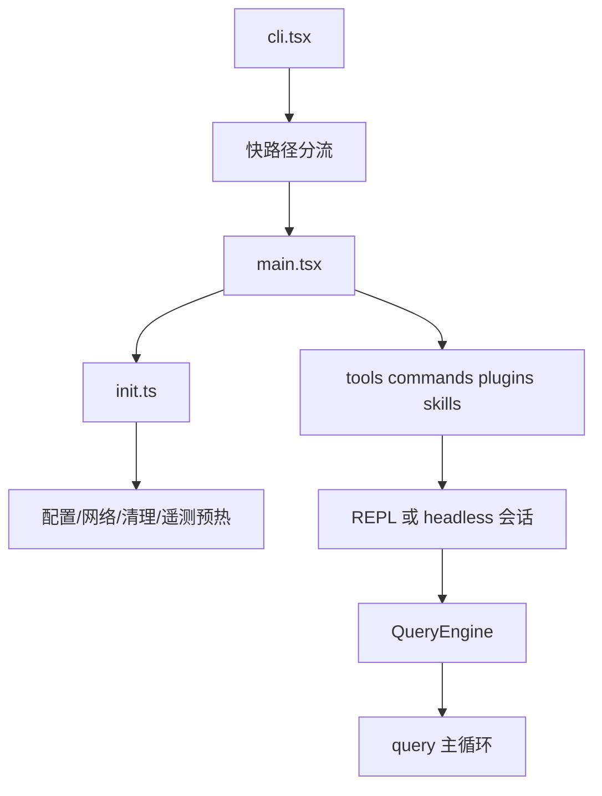

# 源码总地图

> 兼容入口页。当前规范地图请优先阅读 [01-源码结构地图](01-%E6%BA%90%E7%A0%81%E7%BB%93%E6%9E%84%E5%9C%B0%E5%9B%BE.md)；本页保留用于兼容旧命名与旧引用。

## 总体印象

Claude Code 的目录不是围绕“模型调用”组织的，而是围绕“一个可运行的终端代理系统”组织的。最大体量不在单个模型层，而在 `utils/`、`components/`、`commands/`、`tools/`、`services/`。

按本地统计，`src/` 主要模块分布如下：

| 目录 | 文件数 | 说明 |
| --- | ---: | --- |
| `utils` | 564 | 启动、权限、Git、会话、遥测、模型、缓存、工作区等通用基础设施 |
| `components` | 389 | Ink/React 终端 UI 组件 |
| `commands` | 207 | 命令与命令子系统 |
| `tools` | 184 | Tool 实现与 Agent 执行面 |
| `services` | 130 | MCP、API、策略、远程设置、LSP 等服务层 |
| `hooks` | 104 | 交互与状态 hook |
| `ink` | 96 | 终端渲染基础设施 |
| 其他目录 | 318 | entrypoints、skills、tasks、remote、bridge、state 等 |

这说明 Claude Code 的主轴不是“一个聪明 prompt”，而是“一套复杂运行时”。

## 启动链路

可以把启动链路看成三层：

### 第 1 层：`cli.tsx` 负责快路径分流

`src/entrypoints/cli.tsx` 的职责不是完整启动系统，而是尽量在最前面把不需要重型初始化的路径拦截掉。

关键证据：

- `src/entrypoints/cli.tsx:28` 到 `:31` 明确写了 fast-path 目标
- `src/entrypoints/cli.tsx:36` 到 `:41` 对 `--version` 做零额外导入
- `src/entrypoints/cli.tsx:108` 到 `:161` 把 remote-control/bridge 独立分流
- `src/entrypoints/cli.tsx:182` 到 `:208` 把后台会话管理单独分流

这背后的设计哲学很直接：启动成本是真实成本，能不付就不付。

### 第 2 层：`init.ts` 负责 runtime 底座

`src/entrypoints/init.ts` 不是“顺手初始化一下”，而是在做一个长期运行 runtime 的基建：

- 启用配置系统：`src/entrypoints/init.ts:62`
- 在 trust 前仅应用安全环境变量：`src/entrypoints/init.ts:71`
- 提前做 1P 日志初始化：`src/entrypoints/init.ts:90`
- 预加载 remote settings/policy limits：`src/entrypoints/init.ts:120`
- 装配 mTLS、代理、API 预连接：`src/entrypoints/init.ts:134`、`:143`、`:153`
- 注册清理器与 scratchpad：`src/entrypoints/init.ts:188`、`:202`

这说明 Claude Code 把“配置、网络、安全、清理”视为 agent 能力的一部分，而不是外围脚手架。

### 第 3 层：`main.tsx` 装配完整工作面

`src/main.tsx` 是真正的主装配场。源码中可以直接看到：

- `await init()`：`src/main.tsx:916`
- `getTools(...)`：`src/main.tsx:1868`
- `initBuiltinPlugins()`：`src/main.tsx:1924`
- `initBundledSkills()`：`src/main.tsx:1925`
- `initializeTelemetryAfterTrust()`：`src/main.tsx:2597`
- 多处 `launchRepl(...)`：`src/main.tsx:3134` 之后

换句话说，`main.tsx` 把 CLI 变成 REPL/SDK/任务系统/插件系统共享的主 runtime。

## Core Loop 地图

### QueryEngine 是会话壳

`src/QueryEngine.ts` 把会话级状态包起来：

- `mutableMessages`
- `readFileState`
- `permissionDenials`
- `totalUsage`

源码注释直接定义了职责：

- `src/QueryEngine.ts:175` 到 `:182`
- `src/QueryEngine.ts:209` 进入 `submitMessage()`

它做的不是模型推理，而是“为 query 主循环准备好会话、上下文、系统 prompt、输入处理和回放能力”。

### `query.ts` 是真正的 agent runtime

关键入口：

- `src/query.ts:219` 导出 `query(...)`

基于代码与并行分析结果，这个循环至少包含以下阶段：

1. 预处理消息、技能、memory、system prompt
2. 调用模型并流式接收响应
3. 解析 `tool_use`
4. 执行工具并写回 `tool_result`
5. 根据上下文长度和异常情况做压缩、恢复、续写
6. 持续循环，直到继续资格被正式关闭

这解释了为什么 Claude Code 的表现不像“一问一答”，而更像“持续执行中的开发伙伴”。

## Tool 面组织

### `Tool.ts` 定义的是运行协议

`src/Tool.ts` 不只是定义工具 schema，它把这些内容全部纳入 `ToolUseContext`：

- `AppState`
- 权限上下文
- 历史消息
- agentId 与 attribution
- UI/notification 回调
- 文件缓存、任务写入口、MCP 客户端

关键证据：

- `src/Tool.ts:123`
- `src/Tool.ts:158`

这意味着 Claude Code 的 tool 不是“纯函数插件”，而是 runtime 的一等公民。

### `tools.ts` 是工具池单一真源

`src/tools.ts` 做了两件重要事情：

1. 以 `getAllBaseTools()` 维护基础工具全集：`src/tools.ts:193`
2. 再按 feature flag、环境能力、权限、模式进行裁剪

基础工具里能直接看到：

- 文件读写编辑
- Bash/Grep/Glob
- Skill、Agent、Plan、Todo
- MCP 资源读写
- 若干 gated/internal 工具

这也是 Claude Code 能不断扩能力但不失控的原因：能力增长发生在“统一工具协议”之内。

## 扩展面地图

### Skills

Skills 路径来源于多个层级：

- 用户级：`~/.claude/skills`
- 项目级：`.claude/skills`
- 托管级：managed path 下的 `.claude/skills`
- 插件与 MCP 也能参与 skill 构建

关键证据：

- `src/skills/loadSkillsDir.ts:67`
- `src/skills/loadSkillsDir.ts:78`
- `src/skills/loadSkillsDir.ts:180`

这说明 Skills 不是附加彩蛋，而是正式的提示与工具组合扩展面。

### Plugins

`src/plugins/builtinPlugins.ts` 明确区分了 built-in plugin 与 bundled skills：

- plugin 可在 `/plugin` UI 中启停
- plugin 可携带 skills、hooks、MCP servers
- plugin 具有持久 enabled/disabled 状态

关键证据：

- `src/plugins/builtinPlugins.ts:1`
- `src/plugins/builtinPlugins.ts:52`
- `src/plugins/builtinPlugins.ts:104`

### MCP

`src/entrypoints/mcp.ts` 说明 Claude Code 既是 MCP client，也可以反过来暴露自己的工具为 MCP server：

- 启动 stdio server：`src/entrypoints/mcp.ts:35`
- 枚举内部工具并导出 schema：`src/entrypoints/mcp.ts:59`
- 直接把 Claude Code 工具作为 MCP call 执行：`src/entrypoints/mcp.ts:99`

这意味着 Claude Code 的架构目标不是一个封闭 CLI，而是一个可嵌入的 agent capability surface。

## 初步判断

从目录、入口和关键协议看，Claude Code 最接近的比喻不是“带工具的聊天机器人”，而是“一个把模型、工具、权限、UI、任务、扩展系统焊接在一起的开发终端操作系统”。
