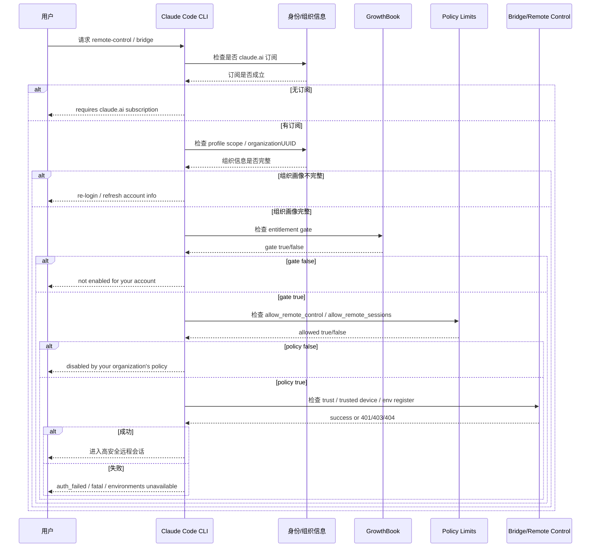
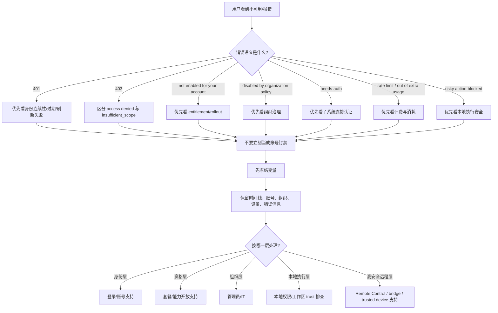
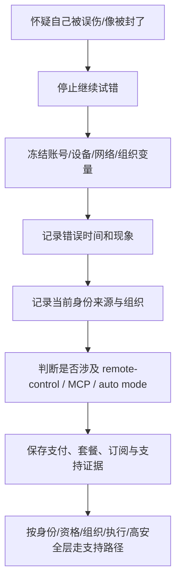

# 图解：Remote Control、能力门槛与误伤处置流程

## 1. 为什么增加这一章

前面的章节已经把结论讲清楚了，但很多读者仍然会卡在两个问题上：

1. Remote Control / 高安全会话到底是按什么顺序被放行或拒绝的？
2. 用户一旦疑似误伤，应该怎么按层处理，而不是把所有问题都当成“被封号”？

这章用图把这两件事压缩出来。

## 2. Remote Control 能力门槛时序图

### 图解结论

这张图最想强调的不是流程长，而是：

- Remote Control 并不是“登录成功就自然获得”的普通功能。
- 它是订阅、组织画像、entitlement、组织策略、工作区 trust、设备信任和远程环境共同成立后的结果。

## 3. 错误语义分流图

### 图解结论

用户最容易犯的错，是在 `B` 这一步没有分清语义，就直接开始反复切换账号、换 token、换 provider。

## 4. 误伤处置最小流程图

### 图解结论

误伤时最有效的不是“再试一次”，而是：

- 让问题保持可解释
- 让支持团队有材料
- 不让自己把单层问题试成跨层混乱

## 5. 为什么图解层对中国用户尤其重要

高波动跨境网络环境的用户，更容易在一段短时间里同时触发：

- token 失效与刷新不稳定
- 组织画像不完整
- 远程链路不连续
- 高安全会话重建失败

这时如果没有图解层，很容易把所有异常都压成“是不是被封了”。  
而图解层的价值，就是把这种情绪反应重新拆回治理层。

## 6. 一句话总结

把风控做成图之后，最清楚的一点反而不是“它很复杂”，而是“它根本不是单点封号逻辑，而是一连串分层资格与边界检查”。
