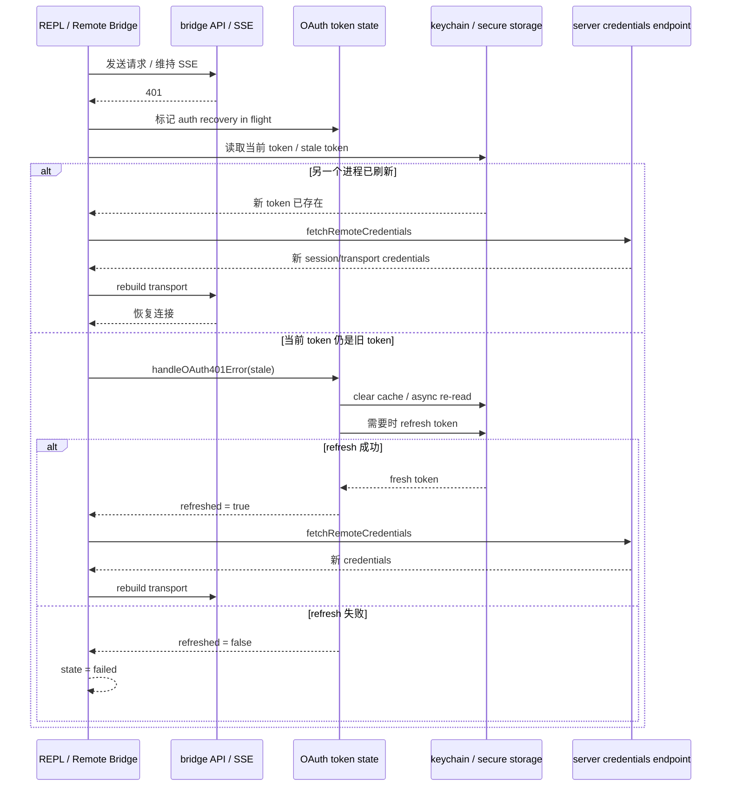
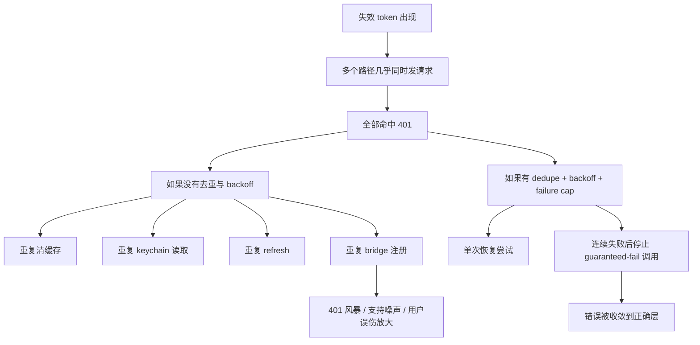
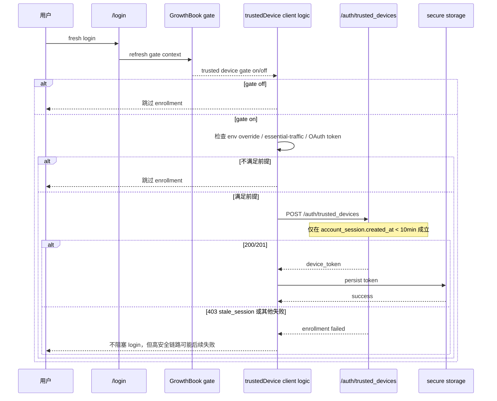
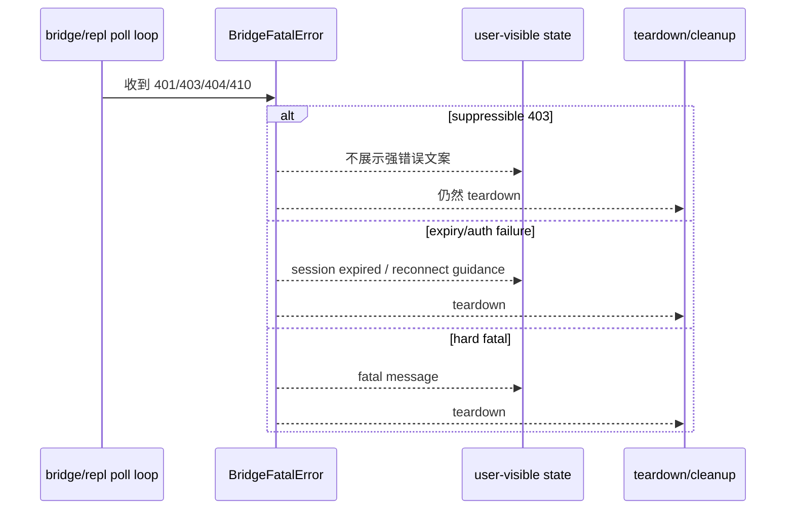

# 图解：Bridge、Trusted Device 与 401 Recovery 精细时序

## 1. 为什么还要再加一张更细的时序图

`risk/14` 已经给出总图。  
这一章补的是更细粒度的内部时序，回答三个更技术的问题：

1. bridge 为什么会对 401 如此敏感？
2. trusted device 为什么必须紧跟 fresh login？
3. 为什么系统要同时处理 refresh、reconnect、backoff 和 fatal teardown？

## 2. Bridge 401 Recovery 精细时序

### 图解结论

这里最重要的技术判断是：

- 401 recovery 不是“再试一次”。
- 它是“身份恢复 -> 凭证重取 -> transport 重建”的组合流程。

## 3. 为什么系统还要做 cross-process backoff

### 图解结论

这解释了为什么“失败风暴控制”本身也是风控设计的一部分。  
一个不能抑制认证失败扩散的系统，最终会对正常用户也不公平。

## 4. Trusted Device Enrollment 精细时序

### 图解结论

trusted device 的关键不在“有没有 token”，而在：

- 是否处于 fresh login 窗口
- 是否处在正确 gate、流量级别和身份上下文里

这说明它不是普通持久化字段，而是 step-up auth 过程的一部分。

## 5. REPL Fatal Error 精细时序

### 图解结论

这里可以看出一个很成熟的取舍：

- 并非所有 403 都应该吓用户。
- 但即便用户不需要看到强报错，系统仍然要把高安全链路 teardown 干净。

## 6. 技术启示

这组时序图给构建者的启示很明确：

1. 高安全远程能力不要复用普通请求恢复逻辑。
2. 401 recovery 要包含 transport rebuild，而不只是 token refresh。
3. step-up auth 与 token expiry 必须明确区分。
4. 跨进程失败风暴治理本身要进入架构设计。
5. 某些错误可以 suppress UI，但不能 suppress cleanup。

## 7. 一句话总结

Bridge / trusted device / 401 recovery 这些源码最有价值的地方，不在于它们“更复杂”，而在于它们把高安全会话当成独立系统认真设计了。
